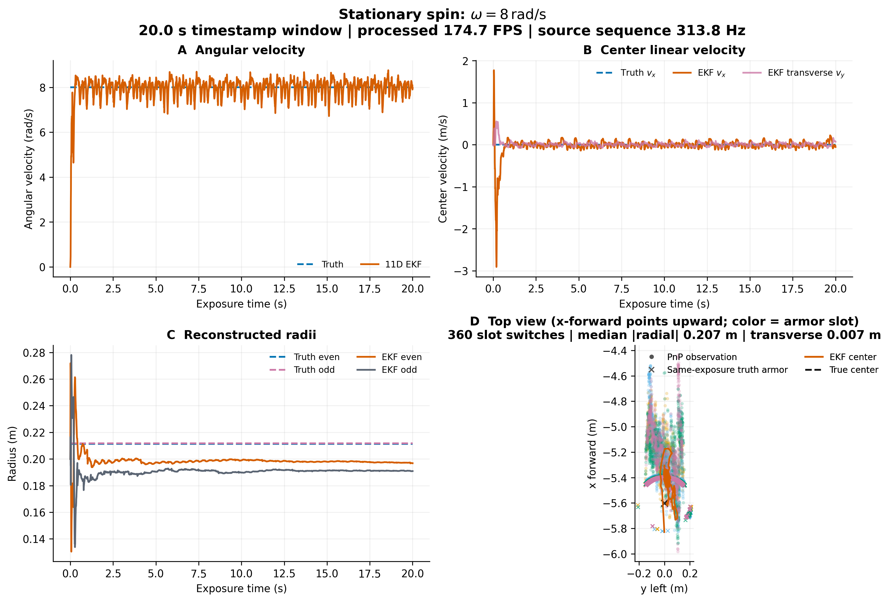
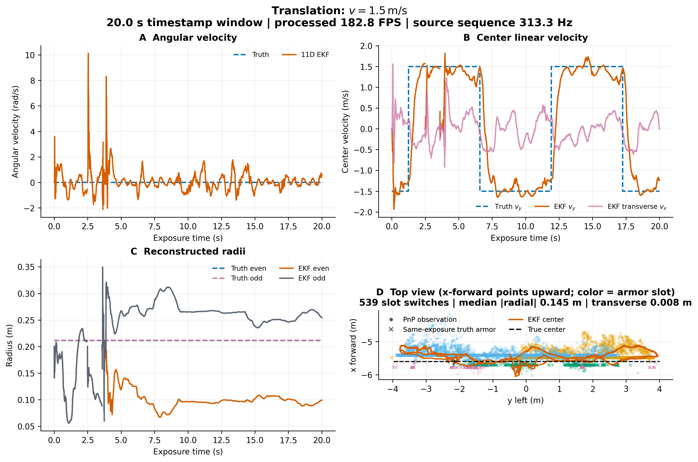
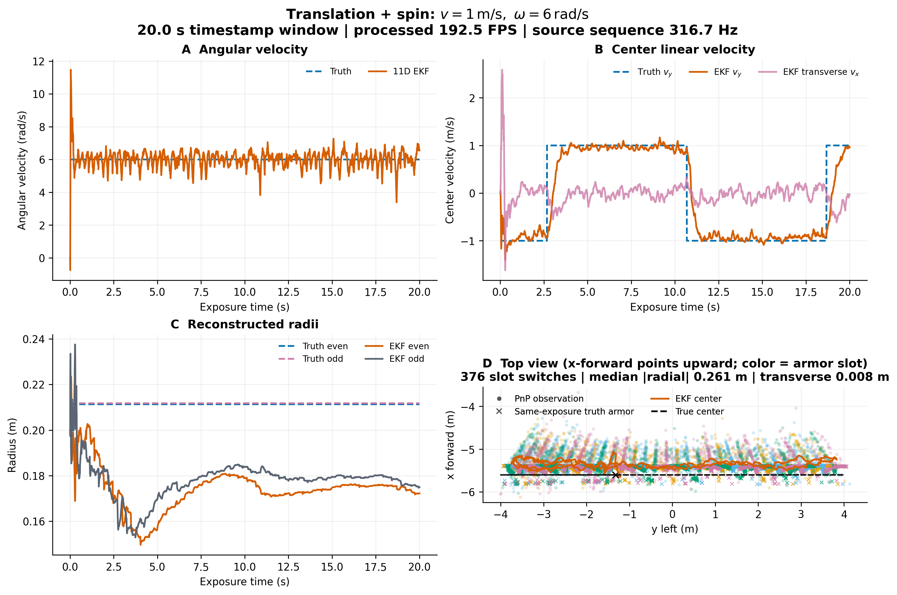

# 11 维 EKF 异常基线

这组实验只回答一个问题：现有 11 维 EKF 维护的角速度、中心速度和长短半径，
与模拟器真值相比呈现什么偏差。它是后续讨论原因与改进方案的起点，不预设结论。

## 固定条件

- Daedalus `1.4.0-learning-r1` Linux x86_64 正式 Release。
- `--performance` 高性能无前端模式，不启动可见窗口。
- `modules/autoaim-research` 内的同济 `sp_vision_25` 11 维 EKF。
- TensorRT `11.2.1` + CUDA `13.3` FP16，并使用 CUDA 融合图像预处理。
- 3 号靶车；独立真值云台只控制未来视角，不向 detector、PnP 或 EKF 提供目标真值。
- 每组以曝光 `timestamp_ns` 截取 20 s，并保存
  `(producer_epoch, frame_seq, timestamp_ns)` 三元身份。

可复现采集：

```bash
python3 modules/autoaim-research/experiments/ekf11-baseline/collect.py \
  --output-root /home/potato/Projects/仿真/runtime/autoaim-research/<new-run-id> \
  --duration-s 20 --settle-s 1
```

绘图环境见 [`figures/requirements.txt`](figures/requirements.txt)，生成脚本保留在
[`figures/gen_fig_ekf11_baseline.py`](figures/gen_fig_ekf11_baseline.py)。原始 JSONL 作为受保护实验证据留在
`runtime/autoaim-research/20260825-ekf11-tensorrt-r2`；接受锁和哈希见
[`accepted-run.json`](accepted-run.json)。

## 图与初始观察

| 工况 | 时间窗 | 处理 FPS | TensorRT 推理中位数 | 角速度 RMSE | 中心速率 RMSE | 长/短半径 RMSE |
| --- | ---: | ---: | ---: | ---: | ---: | ---: |
| 原地 `8 rad/s` | 20.002 s | 174.7 | 0.532 ms | 0.494 rad/s | 0.207 m/s | 1.39 / 2.18 cm |
| 平移 `1.5 m/s` | 20.000 s | 182.8 | 0.535 ms | 0.774 rad/s | 0.342 m/s | 10.82 / 6.04 cm |
| `1 m/s + 6 rad/s` | 20.002 s | 192.5 | 0.534 ms | 0.527 rad/s | 0.197 m/s | 3.84 / 3.49 cm |

在同样的 20 秒工况下，CPU 对照分别是 `47.3 / 46.2 / 42.2 FPS`；
TensorRT 对应提升为 `3.69x / 3.96x / 4.56x`。完整 pipeline 中位数为
`3.10 / 2.68 / 2.54 ms`，因此当前主要限制已不是网络推理。







俯视图中，横轴是左向 `y`，纵轴是前向 `x`；圆点是 PnP 观测，
叉号是同曝光的装甲板真值，颜色用来分开四个装甲槽位。它们不应被连成一条
连续轨迹。这次数据的 PnP 横向误差中位数只有约 `7–8 mm`，但沿视线的
深度误差中位数为 `0.145–0.261 m`，因此俯视图会呈现明显的前后拉伸。

图中的启动过渡、丢检和短时跳变均保留，未插值或裁掉。提高观测频率后，
原地旋转和复合运动的角速度 RMSE 降低，但平移工况的角速度 RMSE 反而上升，
中心速度和半径也不是全部改善。因此当前只能确认 11 维状态与真值仍存在可见
偏差；偏差是由 PnP 观测、数据关联、滤波器模型还是参数引起，需要后续
对照实验，这里不把任何一种解释写成标准答案。
