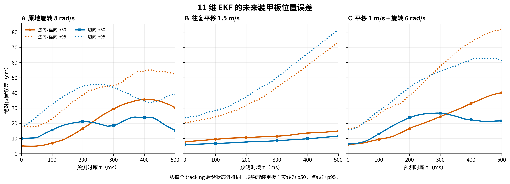
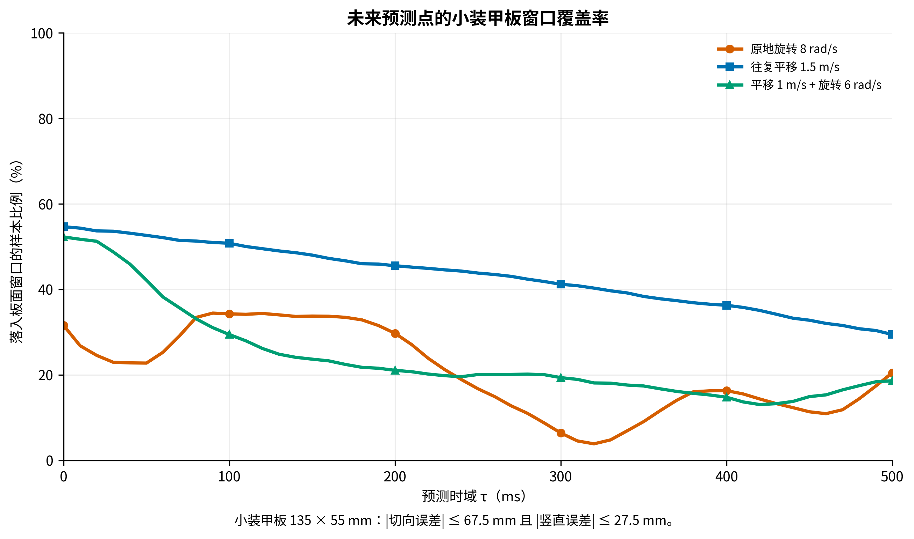

# 11 维 EKF 异常基线

这组实验记录现有 11 维 EKF 的角速度、中心速度、长短半径和后验状态，
并用后验状态计算 `0–500 ms` 的未来装甲板位置误差。

## 固定条件

- Daedalus `1.4.0-learning-r1` Linux x86_64 正式 Release。
- `--performance` 高性能无前端模式，不启动可见窗口。
- `modules/autoaim-research` 内的同济 `sp_vision_25` 11 维 EKF。
- TensorRT `11.2.1` + CUDA `13.3` FP16，并使用 CUDA 融合图像预处理。
- 3 号靶车；独立真值云台只控制未来视角，不向 detector、PnP 或 EKF 提供目标真值。
- 每组以曝光 `timestamp_ns` 截取 20 s，并保存
  `(producer_epoch, frame_seq, timestamp_ns)` 三元身份。

可复现采集：

```bash
python3 modules/autoaim-research/experiments/ekf11-baseline/collect.py \
  --output-root /home/potato/Projects/仿真/runtime/autoaim-research/<new-run-id> \
  --duration-s 20 --settle-s 1
```

绘图环境见 [`figures/requirements.txt`](figures/requirements.txt)，生成脚本保留在
[`figures/gen_fig_ekf11_baseline.py`](figures/gen_fig_ekf11_baseline.py)。原始 JSONL 作为受保护实验证据留在
`runtime/autoaim-research/20260825-ekf11-tensorrt-r2`；接受锁和哈希见
[`accepted-run.json`](accepted-run.json)。

## 图与初始观察

| 工况 | 时间窗 | 处理 FPS | TensorRT 推理中位数 | 角速度 RMSE | 中心速率 RMSE | 长/短半径 RMSE |
| --- | ---: | ---: | ---: | ---: | ---: | ---: |
| 原地 `8 rad/s` | 20.002 s | 174.7 | 0.532 ms | 0.494 rad/s | 0.207 m/s | 1.39 / 2.18 cm |
| 平移 `1.5 m/s` | 20.000 s | 182.8 | 0.535 ms | 0.774 rad/s | 0.342 m/s | 10.82 / 6.04 cm |
| `1 m/s + 6 rad/s` | 20.002 s | 192.5 | 0.534 ms | 0.527 rad/s | 0.197 m/s | 3.84 / 3.49 cm |

在同样的 20 秒工况下，CPU 对照分别是 `47.3 / 46.2 / 42.2 FPS`；
TensorRT 对应提升为 `3.69x / 3.96x / 4.56x`。完整 pipeline 中位数为
`3.10 / 2.68 / 2.54 ms`，因此当前主要限制已不是网络推理。

## 未来装甲板位置误差

评价按
[`AUTOAIM_FUTURE_ARMOR_PREDICTION_V1`](../../docs/PREDICTION_EVALUATION_STANDARD.md)
执行。在曝光时刻 `t` 保存当前帧更新后的滤波器状态，按同济 11 维生产模型
外推同一块物理装甲板至 `t + τ`，再与后续实际曝光中的真值比较。后续真值只由
离线评价器读取。相邻真值曝光的间隔超过 `25 ms` 时，该样本不参与统计。

四装甲刚体模型中，装甲板法向与车体中心指向该装甲板的径向共线。图中将它们合并为
“法向/径向”，另外统计水平面内的切向误差。实线是绝对误差 p50，点线是 p95。



| 工况 | 预测时域 | 法向/径向 p50 / p95 | 切向 p50 / p95 | 竖直 p50 / p95 | 小装甲板窗口覆盖率 |
| --- | ---: | ---: | ---: | ---: | ---: |
| 原地 `8 rad/s` | `100 ms` | `6.9 / 23.0 cm` | `15.5 / 32.5 cm` | `0.7 / 2.2 cm` | `34.3%` |
| 原地 `8 rad/s` | `200 ms` | `16.6 / 38.6 cm` | `21.0 / 44.3 cm` | `0.7 / 2.2 cm` | `29.7%` |
| 原地 `8 rad/s` | `300 ms` | `29.4 / 44.9 cm` | `18.4 / 43.6 cm` | `0.7 / 2.2 cm` | `6.4%` |
| 原地 `8 rad/s` | `500 ms` | `30.2 / 52.1 cm` | `15.2 / 39.2 cm` | `0.7 / 2.2 cm` | `20.5%` |
| 平移 `1.5 m/s` | `100 ms` | `9.4 / 24.2 cm` | `6.7 / 28.3 cm` | `0.6 / 1.4 cm` | `50.8%` |
| 平移 `1.5 m/s` | `200 ms` | `10.6 / 31.8 cm` | `7.7 / 37.3 cm` | `0.6 / 1.4 cm` | `45.5%` |
| 平移 `1.5 m/s` | `300 ms` | `11.5 / 43.8 cm` | `8.5 / 50.3 cm` | `0.6 / 1.4 cm` | `41.2%` |
| 平移 `1.5 m/s` | `500 ms` | `14.9 / 73.4 cm` | `11.5 / 81.6 cm` | `0.6 / 1.4 cm` | `29.4%` |
| `1 m/s + 6 rad/s` | `100 ms` | `9.3 / 26.0 cm` | `12.9 / 28.1 cm` | `0.9 / 2.4 cm` | `29.4%` |
| `1 m/s + 6 rad/s` | `200 ms` | `16.5 / 38.3 cm` | `23.6 / 43.6 cm` | `0.9 / 2.4 cm` | `21.1%` |
| `1 m/s + 6 rad/s` | `300 ms` | `24.3 / 57.4 cm` | `26.6 / 54.3 cm` | `0.9 / 2.4 cm` | `19.3%` |
| `1 m/s + 6 rad/s` | `500 ms` | `40.0 / 81.8 cm` | `21.6 / 61.1 cm` | `1.0 / 2.4 cm` | `18.6%` |

当前数据中的观测对象均为小装甲板。小装甲板尺寸为 `135 × 55 mm`，以中心为
瞄准点时的理想板面窗口是 `|切向误差| ≤ 67.5 mm` 且 `|竖直误差| ≤ 27.5 mm`。
大装甲板尺寸为 `225 × 55 mm`，对应边界是 `112.5 mm` 和 `27.5 mm`。
法向/径向误差另行用于距离和弹道评价。



完整分位数、样本数、四块装甲板的本体系偏移与评价定义保存在
[`figures/prediction_horizon_summary.json`](figures/prediction_horizon_summary.json)。


俯视图中，横轴是左向 `y`，纵轴是前向 `x`；圆点是 PnP 观测，
叉号是同曝光的装甲板真值，颜色用来分开四个装甲槽位。它们不应被连成一条
连续轨迹。这次数据的 PnP 横向误差中位数只有约 `7–8 mm`，但沿视线的
深度误差中位数为 `0.145–0.261 m`，因此俯视图会呈现明显的前后拉伸。

图中的启动过渡、丢检和短时跳变均保留，未插值或裁掉。提高观测频率后，
原地旋转和复合运动的角速度 RMSE 降低，但平移工况的角速度 RMSE 反而上升，
中心速度和半径也不是全部改善。因此当前只能确认 11 维状态与真值仍存在可见
偏差；偏差是由 PnP 观测、数据关联、滤波器模型还是参数引起，需要后续
对照实验，这里不把任何一种解释写成标准答案。
